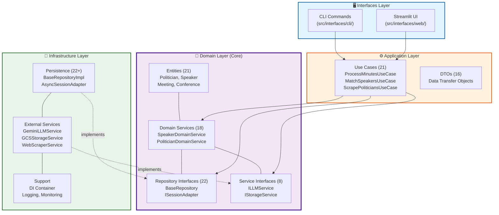
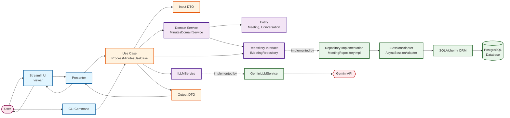
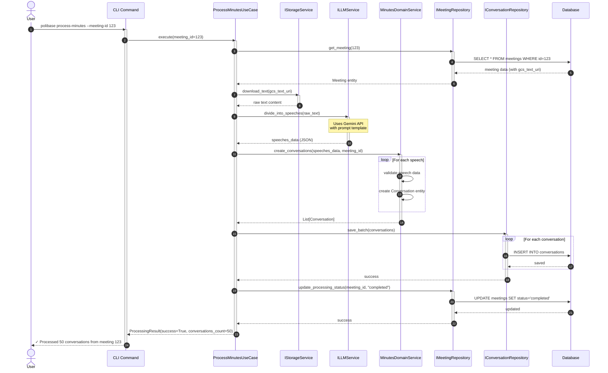
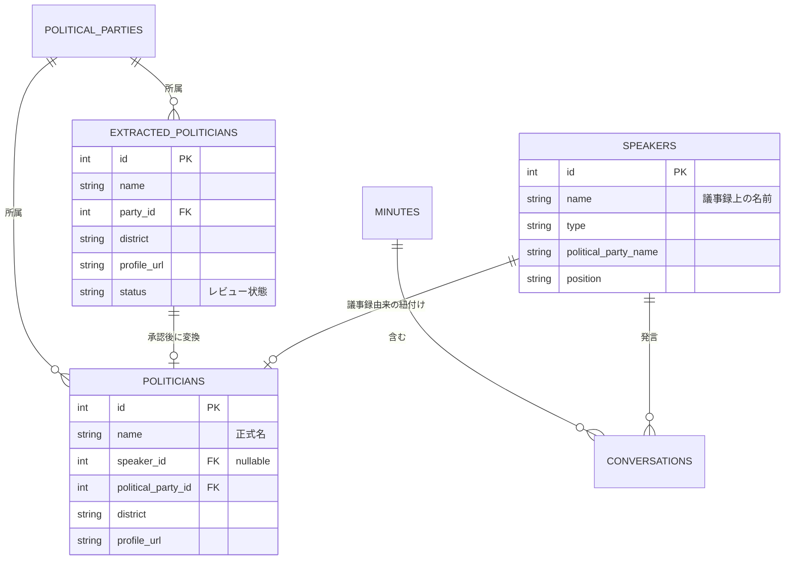

# Polibase アーキテクチャドキュメント

> 📚 **詳細な図とガイド**: [diagrams/](diagrams/) ディレクトリにすべてのアーキテクチャ図とその詳細な説明があります

## システム概要

Polibaseは日本の政治活動を追跡・分析するためのアプリケーションです。議事録からの発言抽出、政治家情報の管理、会議体メンバーの追跡などの機能を提供します。

## アーキテクチャ概要

本システムはClean Architectureの原則に基づいて設計されており、以下の4つの層から構成されています：

### レイヤー依存関係図

> 📖 詳細: [diagrams/layer-dependency.mmd](diagrams/layer-dependency.mmd)

**重要原則**:
- **依存性ルール**: 依存関係は内側（ドメイン層）に向かう
- **ドメイン独立性**: ドメイン層は外部フレームワークに依存しない
- **テスタビリティ**: 各層を独立してモック・テスト可能

## 層の詳細

### 1. ドメイン層 (Domain Layer)

ビジネスロジックとビジネスルールを含む、システムの中核となる層です。

#### 主要エンティティ

- **GoverningBody**: 開催主体（国、都道府県、市町村）
- **Conference**: 会議体（議会、委員会）
- **Meeting**: 会議の具体的な開催インスタンス
- **Speaker**: 議事録から抽出された発言者（議事録における政治家の表現を記録）
- **Politician**: 政治家マスタデータ（議事録由来または政党サイト由来）
- **ExtractedPolitician**: 政党サイトから抽出された政治家の中間データ（レビュー後にPoliticianに変換）
- **Conversation**: 発言内容
- **PoliticalParty**: 政党
- **ParliamentaryGroup**: 議員団（会派）

#### ドメインサービス

- **SpeakerDomainService**: 発言者関連のビジネスロジック
- **PoliticianDomainService**: 政治家関連のビジネスロジック
- **MinutesDomainService**: 議事録処理のビジネスロジック
- **ConferenceDomainService**: 会議体関連のビジネスロジック
- **ParliamentaryGroupDomainService**: 議員団関連のビジネスロジック

### 2. アプリケーション層 (Application Layer)

ユースケースの実装とビジネスフローの調整を行う層です。

#### 主要ユースケース

- **ProcessMinutesUseCase**: 議事録処理
- **MatchSpeakersUseCase**: 発言者と政治家のマッチング
- **ScrapePoliticiansUseCase**: 政治家情報のスクレイピング
- **ManageConferenceMembersUseCase**: 会議体メンバー管理

### 3. インフラストラクチャ層 (Infrastructure Layer)

外部システムとの連携を実装する層です。

#### コンポーネント

- **Persistence**: PostgreSQLデータベースアクセス（SQLAlchemy）
- **External Services**:
  - LLMService: Gemini APIとの連携
  - StorageService: Google Cloud Storageとの連携
  - WebScraperService: Webスクレイピング（Playwright）

### 4. インターフェース層 (Interfaces Layer)

ユーザーとのインタラクションを担当する層です。

#### コンポーネント

- **CLI**: コマンドラインインターフェース
- **Web**: Streamlit ベースのWeb UI

## コンポーネント相互作用

> 📖 詳細: [diagrams/component-interaction.mmd](diagrams/component-interaction.mmd)

以下の図は、典型的なリクエストフローにおけるコンポーネント間の相互作用を示しています：

**重要な設計パターン**:
- **依存性逆転**: ユースケースはインターフェースに依存、実装に依存しない
- **DTOパターン**: データ転送オブジェクトがドメインモデルの漏洩を防ぐ
- **リポジトリパターン**: データアクセスロジックを抽象化
- **アダプターパターン**: ISessionAdapterがSQLAlchemyセッションを適応

## データフロー

### 1. 議事録処理フロー

> 📖 詳細: [diagrams/data-flow-minutes-processing.mmd](diagrams/data-flow-minutes-processing.mmd)

このシーケンス図は、議事録PDF/テキストから構造化された会話データへの完全なフローを示しています：

**データ変換**: `PDF/Text → Raw Text → LLM JSON → Conversation Entities → Database Records`

### 2. 発言者マッチングフロー

> 📖 詳細: [diagrams/data-flow-speaker-matching.mmd](diagrams/data-flow-speaker-matching.mmd)

ルールベース + LLMハイブリッドアプローチによる発言者と政治家のマッチング：

**マッチング戦略**:
- **フェーズ1**: 発言者抽出（名前正規化、既存speaker検索、新規speaker作成）
- **フェーズ2**: 政治家マッチング（候補検索、LLMファジーマッチング、信頼度≥0.7で自動リンク）

**なぜLLMマッチングが必要か**:
日本語の議事録では名前の表記揺れが多い（例：山田太郎君、山田議員、山田太郎）

### 3. 政治家情報スクレイピングフロー

> 📖 詳細: [diagrams/data-flow-politician-scraping.mmd](diagrams/data-flow-politician-scraping.mmd)

政党Webサイトからの政治家データスクレイピングの3段階プロセス：

**3段階プロセス**:
1. **スクレイピング**: PlaywrightでWebページ取得、LLMで構造化データ抽出
2. **ステージング**: `extracted_politicians`テーブルに保存（status = pending）
3. **レビューと変換**: 管理者承認後、`politicians`テーブルに変換

**なぜステージングテーブルが必要か**:
1. 品質管理（マスターデータ追加前の人手レビュー）
2. エラー検出（LLM抽出ミスのキャッチ）
3. 重複防止（既存データとの確認）
4. 監査証跡（いつ何が抽出されたかの追跡）

## リポジトリパターン

> 📖 詳細: [diagrams/repository-pattern.mmd](diagrams/repository-pattern.mmd)

Polibaseのリポジトリパターン実装は、Clean Architectureの原則に従っています：

### 主要コンポーネント

**ドメイン層（抽象化）**:
- `BaseRepository[T]`: ジェネリックリポジトリインターフェース（共通CRUD操作）
- エンティティ固有リポジトリ: 特化したクエリメソッドを追加
- `ISessionAdapter`: データベースセッション管理の抽象化

**インフラストラクチャ層（実装）**:
- `BaseRepositoryImpl[T]`: ジェネリックSQLAlchemy実装
- 具体的な実装: 特化メソッドを実装（例：`MeetingRepositoryImpl.find_by_date_range()`）
- `AsyncSessionAdapter`: SQLAlchemy AsyncSessionのラッパー

### 設計の利点

1. **依存性逆転**: ユースケースはインターフェースに依存、実装には依存しない
2. **テスト容易性**: モックリポジトリで簡単にテスト可能
3. **フレームワーク独立性**: ドメイン層はSQLAlchemyを知らない
4. **一貫性のあるAPI**: すべてのリポジトリが共通インターフェースを共有
5. **Async/Await対応**: すべてのリポジトリメソッドが非同期

### エンティティ関係図

## 技術スタック

### バックエンド
- **言語**: Python 3.11+
- **フレームワーク**:
  - FastAPI (将来的なAPI実装用)
  - Streamlit (Web UI)
  - Click (CLI)
- **ORM**: SQLAlchemy 2.0
- **非同期処理**: asyncio

### データベース
- **RDBMS**: PostgreSQL 15
- **マイグレーション**: SQL ファイル管理

### 外部サービス
- **LLM**: Google Gemini API (gemini-2.0-flash)
- **ストレージ**: Google Cloud Storage
- **Webスクレイピング**: Playwright

### 開発ツール
- **パッケージ管理**: UV
- **コンテナ**: Docker, Docker Compose
- **コード品質**: Ruff, Pyright
- **テスト**: pytest, pytest-asyncio

## セキュリティ考慮事項

1. **APIキー管理**
   - 環境変数による管理
   - .envファイルはGit管理外

2. **データアクセス**
   - リポジトリパターンによるアクセス制御
   - SQLインジェクション対策（SQLAlchemy使用）

3. **外部サービス連携**
   - APIキーの適切な管理
   - レート制限の考慮

## パフォーマンス考慮事項

1. **非同期処理**
   - I/O処理の非同期化
   - 並行処理による高速化

2. **キャッシング**
   - Webスクレイピング結果のキャッシュ
   - LLM呼び出し結果のキャッシュ

3. **バッチ処理**
   - 大量データの分割処理
   - プログレス表示

## 拡張性

1. **新しい外部サービスの追加**
   - インターフェースを定義
   - インフラストラクチャ層に実装を追加

2. **新しいエンティティの追加**
   - ドメイン層にエンティティを定義
   - 対応するリポジトリインターフェースを作成

3. **新しいユースケースの追加**
   - アプリケーション層にユースケースを実装
   - 必要に応じてDTOを定義

## 今後の改善計画

1. **DIコンテナの導入**
   - 依存性注入の自動化
   - テストの容易化

2. **イベント駆動アーキテクチャ**
   - ドメインイベントの実装
   - 非同期メッセージング

3. **API層の実装**
   - RESTful API
   - GraphQL対応

4. **監視・ロギング**
   - 構造化ログ
   - メトリクス収集
   - エラートラッキング
