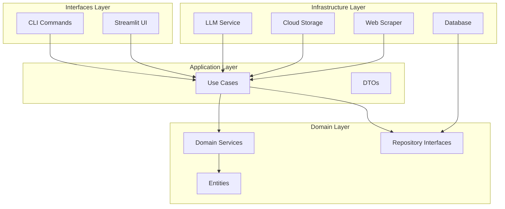
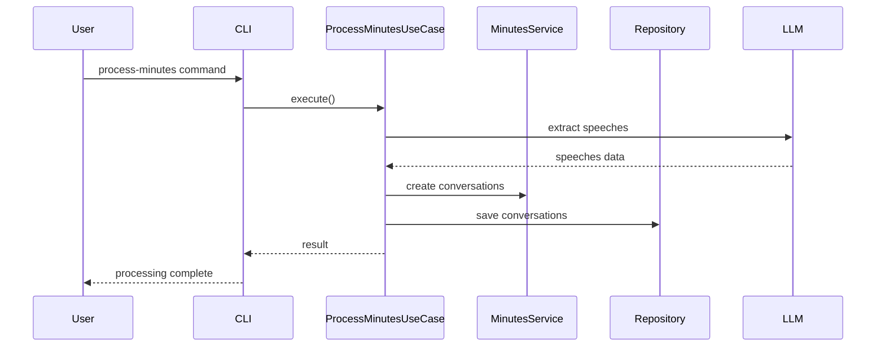
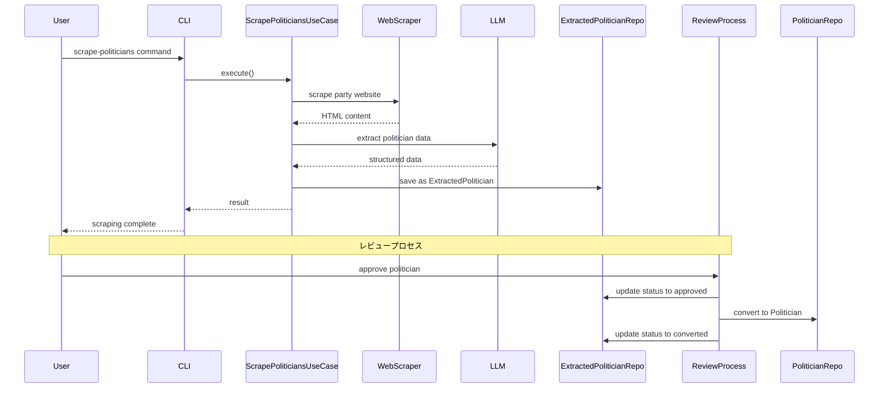
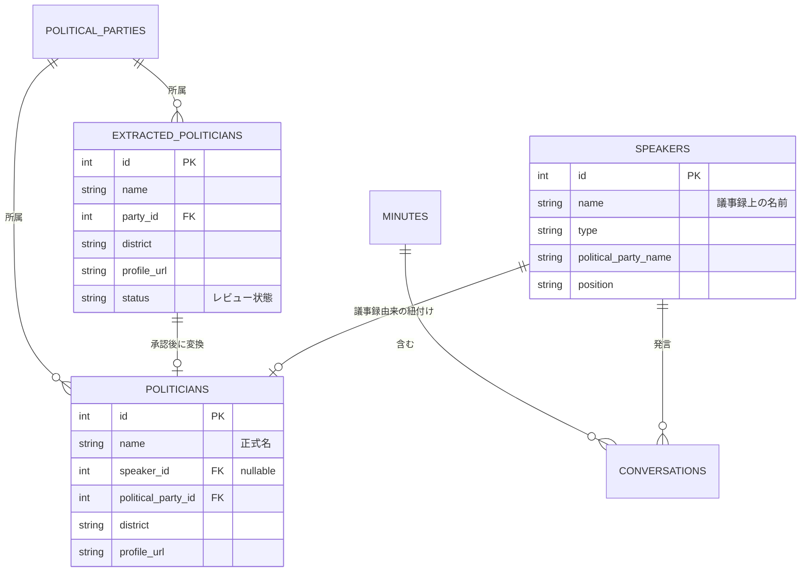

# Polibase アーキテクチャドキュメント

## システム概要

Polibaseは日本の政治活動を追跡・分析するためのアプリケーションです。議事録からの発言抽出、政治家情報の管理、会議体メンバーの追跡などの機能を提供します。

## アーキテクチャ概要

本システムはClean Architectureの原則に基づいて設計されており、以下の4つの層から構成されています：

## 層の詳細

### 1. ドメイン層 (Domain Layer)

ビジネスロジックとビジネスルールを含む、システムの中核となる層です。

#### 主要エンティティ

- **GoverningBody**: 開催主体（国、都道府県、市町村）
- **Conference**: 会議体（議会、委員会）
- **Meeting**: 会議の具体的な開催インスタンス
- **Speaker**: 議事録から抽出された発言者（議事録における政治家の表現を記録）
- **Politician**: 政治家マスタデータ（議事録由来または政党サイト由来）
- **ExtractedPolitician**: 政党サイトから抽出された政治家の中間データ（レビュー後にPoliticianに変換）
- **Conversation**: 発言内容
- **PoliticalParty**: 政党
- **ParliamentaryGroup**: 議員団（会派）

#### ドメインサービス

- **SpeakerDomainService**: 発言者関連のビジネスロジック
- **PoliticianDomainService**: 政治家関連のビジネスロジック
- **MinutesDomainService**: 議事録処理のビジネスロジック
- **ConferenceDomainService**: 会議体関連のビジネスロジック
- **ParliamentaryGroupDomainService**: 議員団関連のビジネスロジック

### 2. アプリケーション層 (Application Layer)

ユースケースの実装とビジネスフローの調整を行う層です。

#### 主要ユースケース

- **ProcessMinutesUseCase**: 議事録処理
- **MatchSpeakersUseCase**: 発言者と政治家のマッチング
- **ScrapePoliticiansUseCase**: 政治家情報のスクレイピング
- **ManageConferenceMembersUseCase**: 会議体メンバー管理

### 3. インフラストラクチャ層 (Infrastructure Layer)

外部システムとの連携を実装する層です。

#### コンポーネント

- **Persistence**: PostgreSQLデータベースアクセス（SQLAlchemy）
- **External Services**:
  - LLMService: Gemini APIとの連携
  - StorageService: Google Cloud Storageとの連携
  - WebScraperService: Webスクレイピング（Playwright）

### 4. インターフェース層 (Interfaces Layer)

ユーザーとのインタラクションを担当する層です。

#### コンポーネント

- **CLI**: コマンドラインインターフェース
- **Web**: Streamlit ベースのWeb UI

## データフロー

### 1. 議事録処理フロー

### 2. 政治家情報スクレイピングフロー

### 3. エンティティ関係図

## 技術スタック

### バックエンド
- **言語**: Python 3.11+
- **フレームワーク**:
  - FastAPI (将来的なAPI実装用)
  - Streamlit (Web UI)
  - Click (CLI)
- **ORM**: SQLAlchemy 2.0
- **非同期処理**: asyncio

### データベース
- **RDBMS**: PostgreSQL 15
- **マイグレーション**: SQL ファイル管理

### 外部サービス
- **LLM**: Google Gemini API (gemini-2.0-flash)
- **ストレージ**: Google Cloud Storage
- **Webスクレイピング**: Playwright

### 開発ツール
- **パッケージ管理**: UV
- **コンテナ**: Docker, Docker Compose
- **コード品質**: Ruff, Pyright
- **テスト**: pytest, pytest-asyncio

## セキュリティ考慮事項

1. **APIキー管理**
   - 環境変数による管理
   - .envファイルはGit管理外

2. **データアクセス**
   - リポジトリパターンによるアクセス制御
   - SQLインジェクション対策（SQLAlchemy使用）

3. **外部サービス連携**
   - APIキーの適切な管理
   - レート制限の考慮

## パフォーマンス考慮事項

1. **非同期処理**
   - I/O処理の非同期化
   - 並行処理による高速化

2. **キャッシング**
   - Webスクレイピング結果のキャッシュ
   - LLM呼び出し結果のキャッシュ

3. **バッチ処理**
   - 大量データの分割処理
   - プログレス表示

## 拡張性

1. **新しい外部サービスの追加**
   - インターフェースを定義
   - インフラストラクチャ層に実装を追加

2. **新しいエンティティの追加**
   - ドメイン層にエンティティを定義
   - 対応するリポジトリインターフェースを作成

3. **新しいユースケースの追加**
   - アプリケーション層にユースケースを実装
   - 必要に応じてDTOを定義

## 今後の改善計画

1. **DIコンテナの導入**
   - 依存性注入の自動化
   - テストの容易化

2. **イベント駆動アーキテクチャ**
   - ドメインイベントの実装
   - 非同期メッセージング

3. **API層の実装**
   - RESTful API
   - GraphQL対応

4. **監視・ロギング**
   - 構造化ログ
   - メトリクス収集
   - エラートラッキング
