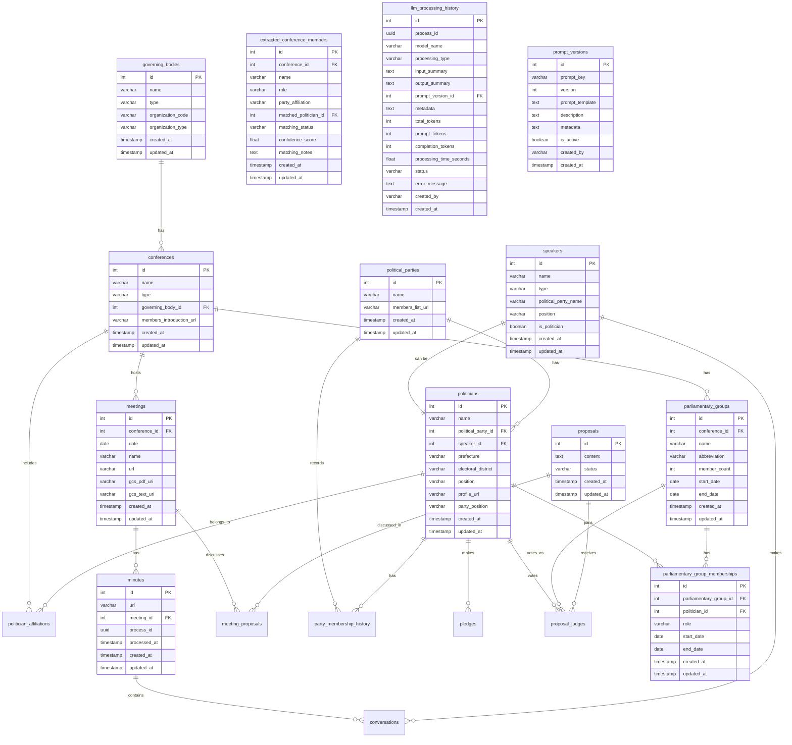

# データベース設計

## 目次
- [概要](#概要)
- [ER図](#er図)
- [テーブル定義](#テーブル定義)
- [インデックス設計](#インデックス設計)
- [制約とリレーション](#制約とリレーション)
- [マイグレーション戦略](#マイグレーション戦略)
- [パフォーマンス最適化](#パフォーマンス最適化)
- [バックアップとリカバリー](#バックアップとリカバリー)

## 概要

Polibaseのデータベースは、日本の政治活動データを構造化して管理するために設計されています。PostgreSQL 15を使用し、政治家、会議、議事録、発言、公約、投票記録などの情報を正規化されたリレーショナルデータベースとして管理します。

### 設計方針
- **正規化**: 第3正規形まで正規化
- **拡張性**: 新しいデータ型の追加が容易
- **パフォーマンス**: 適切なインデックス設計
- **整合性**: 外部キー制約による参照整合性
- **履歴管理**: 時系列データの保持

## ER図



## テーブル定義

### マスターデータテーブル

#### governing_bodies（開催主体）
政府機関や地方自治体を管理するマスターテーブル。

| カラム名 | 型 | 制約 | 説明 |
|---------|-----|------|------|
| id | SERIAL | PRIMARY KEY | 主キー |
| name | VARCHAR | NOT NULL | 開催主体名 |
| type | VARCHAR | | 種別（国、都道府県、市町村） |
| organization_code | VARCHAR | | 組織コード（総務省全国地方公共団体コード） |
| organization_type | VARCHAR | | 組織タイプ（prefecture, city, special_ward等） |
| created_at | TIMESTAMP | DEFAULT CURRENT_TIMESTAMP | 作成日時 |
| updated_at | TIMESTAMP | DEFAULT CURRENT_TIMESTAMP | 更新日時 |

**特徴**:
- 1,966の全日本自治体を含む
- 組織コードで一意に識別可能
- UNIQUE制約: (name, type)

#### conferences（会議体）
議会や委員会などの会議体を管理。

| カラム名 | 型 | 制約 | 説明 |
|---------|-----|------|------|
| id | SERIAL | PRIMARY KEY | 主キー |
| name | VARCHAR | NOT NULL | 会議体名 |
| type | VARCHAR | | 種別（国会全体、議院、地方議会全体、常任委員会） |
| governing_body_id | INTEGER | NOT NULL, REFERENCES governing_bodies(id) | 開催主体ID |
| members_introduction_url | VARCHAR | | メンバー紹介ページURL |
| created_at | TIMESTAMP | DEFAULT CURRENT_TIMESTAMP | 作成日時 |
| updated_at | TIMESTAMP | DEFAULT CURRENT_TIMESTAMP | 更新日時 |

**特徴**:
- 各自治体の議会・委員会を管理
- メンバー紹介URLから議員情報を抽出可能
- UNIQUE制約: (name, governing_body_id)

#### political_parties（政党）
政党情報のマスターテーブル。

| カラム名 | 型 | 制約 | 説明 |
|---------|-----|------|------|
| id | SERIAL | PRIMARY KEY | 主キー |
| name | VARCHAR | NOT NULL, UNIQUE | 政党名 |
| members_list_url | VARCHAR | | 党員リストURL |
| created_at | TIMESTAMP | DEFAULT CURRENT_TIMESTAMP | 作成日時 |
| updated_at | TIMESTAMP | DEFAULT CURRENT_TIMESTAMP | 更新日時 |

### トランザクションテーブル

#### meetings（会議）
具体的な会議の開催インスタンス。

| カラム名 | 型 | 制約 | 説明 |
|---------|-----|------|------|
| id | SERIAL | PRIMARY KEY | 主キー |
| conference_id | INTEGER | NOT NULL, REFERENCES conferences(id) | 会議体ID |
| date | DATE | | 開催日 |
| name | VARCHAR | | 会議名 |
| url | VARCHAR | | 会議情報URL |
| gcs_pdf_uri | VARCHAR | | GCS上のPDF URI |
| gcs_text_uri | VARCHAR | | GCS上のテキストURI |
| created_at | TIMESTAMP | DEFAULT CURRENT_TIMESTAMP | 作成日時 |
| updated_at | TIMESTAMP | DEFAULT CURRENT_TIMESTAMP | 更新日時 |

**特徴**:
- GCS統合によるクラウドストレージ対応
- URLとGCS URIの両方をサポート

#### minutes（議事録）
会議の議事録情報。

| カラム名 | 型 | 制約 | 説明 |
|---------|-----|------|------|
| id | SERIAL | PRIMARY KEY | 主キー |
| url | VARCHAR | | 議事録URL |
| meeting_id | INTEGER | NOT NULL, REFERENCES meetings(id) | 会議ID |
| process_id | UUID | | 処理ID（LLM処理追跡用） |
| processed_at | TIMESTAMP | | 処理完了日時 |
| created_at | TIMESTAMP | DEFAULT CURRENT_TIMESTAMP | 作成日時 |
| updated_at | TIMESTAMP | DEFAULT CURRENT_TIMESTAMP | 更新日時 |

#### conversations（発言）
議事録から抽出された個別の発言。

| カラム名 | 型 | 制約 | 説明 |
|---------|-----|------|------|
| id | SERIAL | PRIMARY KEY | 主キー |
| minutes_id | INTEGER | REFERENCES minutes(id) | 議事録ID |
| speaker_id | INTEGER | REFERENCES speakers(id) | 発言者ID |
| speaker_name | VARCHAR | | 元の発言者名 |
| comment | TEXT | NOT NULL | 発言内容 |
| sequence_number | INTEGER | NOT NULL | 発言順序 |
| chapter_number | INTEGER | | 章番号 |
| sub_chapter_number | INTEGER | | 節番号 |
| created_at | TIMESTAMP | DEFAULT CURRENT_TIMESTAMP | 作成日時 |
| updated_at | TIMESTAMP | DEFAULT CURRENT_TIMESTAMP | 更新日時 |

#### speakers（発言者）
発言者の情報を管理。

| カラム名 | 型 | 制約 | 説明 |
|---------|-----|------|------|
| id | SERIAL | PRIMARY KEY | 主キー |
| name | VARCHAR | NOT NULL | 発言者名 |
| type | VARCHAR | | 種別（政治家、参考人、議長、政府職員） |
| political_party_name | VARCHAR | | 所属政党名 |
| position | VARCHAR | | 役職・肩書き |
| is_politician | BOOLEAN | DEFAULT FALSE | 政治家フラグ |
| created_at | TIMESTAMP | DEFAULT CURRENT_TIMESTAMP | 作成日時 |
| updated_at | TIMESTAMP | DEFAULT CURRENT_TIMESTAMP | 更新日時 |

**特徴**:
- UNIQUE制約: (name, political_party_name, position)
- 政治家との1対1リレーション可能

#### politicians（政治家）
政治家の詳細情報。

| カラム名 | 型 | 制約 | 説明 |
|---------|-----|------|------|
| id | SERIAL | PRIMARY KEY | 主キー |
| name | VARCHAR | NOT NULL | 政治家名 |
| political_party_id | INTEGER | REFERENCES political_parties(id) | 所属政党ID |
| speaker_id | INTEGER | UNIQUE, NOT NULL, REFERENCES speakers(id) | 発言者ID |
| prefecture | VARCHAR | | 都道府県 |
| electoral_district | VARCHAR | | 選挙区 |
| position | VARCHAR | | 役職 |
| profile_url | VARCHAR | | プロフィールURL |
| party_position | VARCHAR | | 党内役職 |
| created_at | TIMESTAMP | DEFAULT CURRENT_TIMESTAMP | 作成日時 |
| updated_at | TIMESTAMP | DEFAULT CURRENT_TIMESTAMP | 更新日時 |

### 議員団関連テーブル

#### parliamentary_groups（議員団）
会議体内の議員団（会派）を管理。

| カラム名 | 型 | 制約 | 説明 |
|---------|-----|------|------|
| id | SERIAL | PRIMARY KEY | 主キー |
| conference_id | INTEGER | NOT NULL, REFERENCES conferences(id) | 会議体ID |
| name | VARCHAR | NOT NULL | 議員団名 |
| abbreviation | VARCHAR | | 略称 |
| member_count | INTEGER | | メンバー数 |
| start_date | DATE | | 結成日 |
| end_date | DATE | | 解散日 |
| created_at | TIMESTAMP | DEFAULT CURRENT_TIMESTAMP | 作成日時 |
| updated_at | TIMESTAMP | DEFAULT CURRENT_TIMESTAMP | 更新日時 |

#### parliamentary_group_memberships（議員団メンバーシップ）
政治家の議員団所属履歴。

| カラム名 | 型 | 制約 | 説明 |
|---------|-----|------|------|
| id | SERIAL | PRIMARY KEY | 主キー |
| parliamentary_group_id | INTEGER | NOT NULL, REFERENCES parliamentary_groups(id) | 議員団ID |
| politician_id | INTEGER | NOT NULL, REFERENCES politicians(id) | 政治家ID |
| role | VARCHAR | | 役職（団長、幹事長等） |
| start_date | DATE | NOT NULL | 所属開始日 |
| end_date | DATE | | 所属終了日 |
| created_at | TIMESTAMP | DEFAULT CURRENT_TIMESTAMP | 作成日時 |
| updated_at | TIMESTAMP | DEFAULT CURRENT_TIMESTAMP | 更新日時 |

### 提案・投票関連テーブル

#### proposals（議案）
議案情報を管理。

| カラム名 | 型 | 制約 | 説明 |
|---------|-----|------|------|
| id | SERIAL | PRIMARY KEY | 主キー |
| content | TEXT | NOT NULL | 議案内容 |
| status | VARCHAR | | ステータス（審議中、可決、否決） |
| created_at | TIMESTAMP | DEFAULT CURRENT_TIMESTAMP | 作成日時 |
| updated_at | TIMESTAMP | DEFAULT CURRENT_TIMESTAMP | 更新日時 |

#### proposal_judges（議案賛否）
議案に対する投票記録。

| カラム名 | 型 | 制約 | 説明 |
|---------|-----|------|------|
| id | SERIAL | PRIMARY KEY | 主キー |
| proposal_id | INTEGER | NOT NULL, REFERENCES proposals(id) | 議案ID |
| politician_id | INTEGER | REFERENCES politicians(id) | 政治家ID |
| politician_party_id | INTEGER | REFERENCES political_parties(id) | 投票時の所属政党ID |
| parliamentary_group_id | INTEGER | REFERENCES parliamentary_groups(id) | 投票時の所属議員団ID |
| approve | VARCHAR | | 賛否（賛成、反対、棄権、欠席） |
| created_at | TIMESTAMP | DEFAULT CURRENT_TIMESTAMP | 作成日時 |
| updated_at | TIMESTAMP | DEFAULT CURRENT_TIMESTAMP | 更新日時 |

### 処理管理テーブル

#### extracted_conference_members（抽出済み会議メンバー）
会議メンバー抽出の中間テーブル。

| カラム名 | 型 | 制約 | 説明 |
|---------|-----|------|------|
| id | SERIAL | PRIMARY KEY | 主キー |
| conference_id | INTEGER | NOT NULL, REFERENCES conferences(id) | 会議体ID |
| name | VARCHAR | NOT NULL | メンバー名 |
| role | VARCHAR | | 役職 |
| party_affiliation | VARCHAR | | 所属政党 |
| matched_politician_id | INTEGER | REFERENCES politicians(id) | マッチした政治家ID |
| matching_status | VARCHAR | DEFAULT 'pending' | マッチングステータス |
| confidence_score | FLOAT | | 信頼度スコア（0-1） |
| matching_notes | TEXT | | マッチング備考 |
| created_at | TIMESTAMP | DEFAULT CURRENT_TIMESTAMP | 作成日時 |
| updated_at | TIMESTAMP | DEFAULT CURRENT_TIMESTAMP | 更新日時 |

**マッチングステータス**:
- `pending`: 未処理
- `matched`: マッチ済み（信頼度 ≥ 0.7）
- `needs_review`: 要確認（0.5 ≤ 信頼度 < 0.7）
- `no_match`: マッチなし（信頼度 < 0.5）
- `manually_matched`: 手動マッチ
- `manually_rejected`: 手動拒否

#### llm_processing_history（LLM処理履歴）
LLM処理の履歴とメトリクスを記録。

| カラム名 | 型 | 制約 | 説明 |
|---------|-----|------|------|
| id | SERIAL | PRIMARY KEY | 主キー |
| process_id | UUID | NOT NULL, DEFAULT uuid_generate_v4() | 処理ID |
| model_name | VARCHAR | NOT NULL | モデル名 |
| processing_type | VARCHAR | NOT NULL | 処理種別 |
| input_summary | TEXT | | 入力サマリー |
| output_summary | TEXT | | 出力サマリー |
| prompt_version_id | INTEGER | REFERENCES prompt_versions(id) | プロンプトバージョンID |
| metadata | JSONB | | メタデータ |
| total_tokens | INTEGER | | 総トークン数 |
| prompt_tokens | INTEGER | | プロンプトトークン数 |
| completion_tokens | INTEGER | | 完了トークン数 |
| processing_time_seconds | FLOAT | | 処理時間（秒） |
| status | VARCHAR | | ステータス |
| error_message | TEXT | | エラーメッセージ |
| created_by | VARCHAR | | 作成者 |
| created_at | TIMESTAMP | DEFAULT CURRENT_TIMESTAMP | 作成日時 |

#### prompt_versions（プロンプトバージョン）
プロンプトテンプレートのバージョン管理。

| カラム名 | 型 | 制約 | 説明 |
|---------|-----|------|------|
| id | SERIAL | PRIMARY KEY | 主キー |
| prompt_key | VARCHAR | NOT NULL | プロンプトキー |
| version | INTEGER | NOT NULL | バージョン番号 |
| prompt_template | TEXT | NOT NULL | プロンプトテンプレート |
| description | TEXT | | 説明 |
| metadata | JSONB | | メタデータ |
| is_active | BOOLEAN | DEFAULT FALSE | アクティブフラグ |
| created_by | VARCHAR | | 作成者 |
| created_at | TIMESTAMP | DEFAULT CURRENT_TIMESTAMP | 作成日時 |

## インデックス設計

### 主要インデックス

```sql
-- 頻繁にJOINされるカラム
CREATE INDEX idx_meetings_conference_id ON meetings(conference_id);
CREATE INDEX idx_minutes_meeting_id ON minutes(meeting_id);
CREATE INDEX idx_conversations_minutes_id ON conversations(minutes_id);
CREATE INDEX idx_conversations_speaker_id ON conversations(speaker_id);
CREATE INDEX idx_politicians_party_id ON politicians(political_party_id);

-- 検索用インデックス
CREATE INDEX idx_politicians_name ON politicians(name);
CREATE INDEX idx_speakers_name ON speakers(name);
CREATE INDEX idx_governing_bodies_type ON governing_bodies(type);
CREATE INDEX idx_governing_bodies_org_code ON governing_bodies(organization_code);

-- 日付範囲検索用
CREATE INDEX idx_meetings_date ON meetings(date);
CREATE INDEX idx_party_membership_dates ON party_membership_history(start_date, end_date);
CREATE INDEX idx_politician_affiliations_dates ON politician_affiliations(start_date, end_date);

-- ステータス検索用
CREATE INDEX idx_proposals_status ON proposals(status);
CREATE INDEX idx_extracted_members_status ON extracted_conference_members(matching_status);
CREATE INDEX idx_llm_history_status ON llm_processing_history(status);

-- 複合インデックス
CREATE INDEX idx_extracted_members_conference_status
    ON extracted_conference_members(conference_id, matching_status);
CREATE INDEX idx_parliamentary_memberships_active
    ON parliamentary_group_memberships(politician_id, end_date);
```

## 制約とリレーション

### 外部キー制約

すべての外部キーには参照整合性制約が設定されています：

- **CASCADE DELETE**: 親レコード削除時に子レコードも削除
  - なし（データの完全性を保つため）

- **RESTRICT DELETE**: 子レコードが存在する場合は親レコードを削除不可
  - すべての外部キー制約

### UNIQUE制約

重複を防ぐための一意性制約：

- `governing_bodies`: (name, type)
- `conferences`: (name, governing_body_id)
- `political_parties`: (name)
- `speakers`: (name, political_party_name, position)
- `politicians`: (speaker_id)
- `prompt_versions`: (prompt_key, version)

### CHECK制約

データの妥当性を保証：

```sql
-- 日付の妥当性
ALTER TABLE party_membership_history
    ADD CONSTRAINT check_membership_dates
    CHECK (end_date IS NULL OR end_date >= start_date);

ALTER TABLE politician_affiliations
    ADD CONSTRAINT check_affiliation_dates
    CHECK (end_date IS NULL OR end_date >= start_date);

-- スコアの範囲
ALTER TABLE extracted_conference_members
    ADD CONSTRAINT check_confidence_score
    CHECK (confidence_score >= 0 AND confidence_score <= 1);
```

## マイグレーション戦略

### マイグレーションファイル構造

```
database/
├── init.sql                    # 初期スキーマ
├── 02_run_migrations.sql       # マイグレーション実行スクリプト
└── migrations/
    ├── 001_add_url_to_meetings.sql
    ├── 002_add_members_list_url_to_political_parties.sql
    ├── 003_add_politician_details.sql
    ├── 004_add_gcs_uri_to_meetings.sql
    ├── 005_add_members_introduction_url_to_conferences.sql
    ├── 006_add_role_to_politician_affiliations.sql
    ├── 007_create_extracted_conference_members_table.sql
    ├── 008_create_parliamentary_groups_tables.sql
    ├── 009_add_processed_at_to_minutes.sql
    ├── 010_add_name_to_meetings.sql
    ├── 011_add_organization_code_to_governing_bodies.sql
    ├── 012_remove_conference_governing_body_fk.sql
    ├── 013_create_llm_processing_history.sql
    ├── 014_create_prompt_versions.sql
    ├── 015_add_party_position_to_politicians.sql
    ├── 016_add_created_by_to_llm_processing_history.sql
    └── 017_add_process_id_to_minutes.sql
```

### マイグレーション実行手順

1. **新規マイグレーション作成**
```bash
# 連番でファイル作成
touch database/migrations/018_your_migration.sql
```

2. **マイグレーションスクリプトに追加**
```sql
-- database/02_run_migrations.sql に追加
\i /docker-entrypoint-initdb.d/migrations/018_your_migration.sql
```

3. **マイグレーション実行**
```bash
# Docker環境で実行
docker compose exec polibase cat database/migrations/018_your_migration.sql | \
    docker compose exec -T postgres psql -U sagebase_user -d sagebase_db

# またはリセット
./reset-database.sh
```

### マイグレーションベストプラクティス

1. **後方互換性**: 既存データを破壊しない
2. **トランザクション**: BEGIN/COMMITで囲む
3. **ロールバック**: DOWN SQLも用意
4. **テスト**: ステージング環境で検証
5. **ドキュメント**: 変更理由を記載

## パフォーマンス最適化

### クエリ最適化

#### 頻出クエリパターン

1. **会議の発言取得**
```sql
SELECT c.*, s.name as speaker_name
FROM conversations c
JOIN speakers s ON c.speaker_id = s.id
WHERE c.minutes_id = ?
ORDER BY c.sequence_number;
```

2. **政治家の発言検索**
```sql
SELECT c.*
FROM conversations c
JOIN speakers s ON c.speaker_id = s.id
JOIN politicians p ON p.speaker_id = s.id
WHERE p.id = ?
ORDER BY c.created_at DESC;
```

3. **議員団メンバー取得**
```sql
SELECT p.*, pgm.role
FROM politicians p
JOIN parliamentary_group_memberships pgm ON p.id = pgm.politician_id
WHERE pgm.parliamentary_group_id = ?
  AND pgm.end_date IS NULL;
```

### パーティショニング

大規模テーブルのパーティショニング戦略：

```sql
-- conversations テーブルを年月でパーティショニング
CREATE TABLE conversations_2024_01 PARTITION OF conversations
    FOR VALUES FROM ('2024-01-01') TO ('2024-02-01');

-- llm_processing_history を処理タイプでパーティショニング
CREATE TABLE llm_history_minutes PARTITION OF llm_processing_history
    FOR VALUES IN ('minutes_processing');
```

### 接続プーリング

```python
# SQLAlchemy接続プール設定
engine = create_async_engine(
    DATABASE_URL,
    pool_size=20,          # 基本プールサイズ
    max_overflow=10,       # 最大オーバーフロー
    pool_timeout=30,       # タイムアウト（秒）
    pool_recycle=3600,     # 接続リサイクル時間（秒）
)
```

### バキューム戦略

```sql
-- 自動バキューム設定
ALTER TABLE conversations SET (autovacuum_vacuum_scale_factor = 0.1);
ALTER TABLE llm_processing_history SET (autovacuum_analyze_scale_factor = 0.05);

-- 定期的な手動バキューム
VACUUM ANALYZE conversations;
VACUUM ANALYZE speakers;
```

## バックアップとリカバリー

### バックアップ戦略

#### 自動バックアップ
```bash
# 日次バックアップ（GCS連携）
docker compose exec polibase uv run polibase database backup

# ローカルのみ
docker compose exec polibase uv run polibase database backup --no-gcs
```

#### バックアップ構成
- **頻度**: 日次
- **保持期間**: 30日間
- **保存先**:
  - ローカル: `database/backups/`
  - クラウド: Google Cloud Storage

### リストア手順

```bash
# 最新バックアップからリストア
docker compose exec polibase uv run polibase database restore backup.sql

# GCSからリストア
docker compose exec polibase uv run polibase database restore gs://bucket/backup.sql

# 特定日付のバックアップをリストア
./backup-database.sh restore database/backups/polibase_backup_20240801_120000.sql
```

### ポイントインタイムリカバリー

```sql
-- WAL（Write Ahead Log）設定
ALTER SYSTEM SET wal_level = replica;
ALTER SYSTEM SET archive_mode = on;
ALTER SYSTEM SET archive_command = 'gsutil cp %p gs://backup-bucket/wal/%f';
```

### 災害復旧計画

1. **RPO（Recovery Point Objective）**: 1時間
2. **RTO（Recovery Time Objective）**: 4時間
3. **バックアップテスト**: 月次
4. **フェイルオーバー手順**: 文書化済み

## セキュリティ考慮事項

### アクセス制御

```sql
-- 読み取り専用ユーザー
CREATE USER readonly_user WITH PASSWORD 'secure_password';
GRANT CONNECT ON DATABASE sagebase_db TO readonly_user;
GRANT USAGE ON SCHEMA public TO readonly_user;
GRANT SELECT ON ALL TABLES IN SCHEMA public TO readonly_user;

-- アプリケーションユーザー
CREATE USER app_user WITH PASSWORD 'secure_password';
GRANT ALL PRIVILEGES ON DATABASE sagebase_db TO app_user;
```

### データ暗号化

- **通信**: SSL/TLS必須
- **保存時**: Transparent Data Encryption（TDE）
- **バックアップ**: AES-256暗号化

### 監査ログ

```sql
-- 監査ログテーブル
CREATE TABLE audit_log (
    id SERIAL PRIMARY KEY,
    table_name VARCHAR NOT NULL,
    operation VARCHAR NOT NULL,
    user_name VARCHAR NOT NULL,
    changed_at TIMESTAMP DEFAULT CURRENT_TIMESTAMP,
    old_values JSONB,
    new_values JSONB
);

-- トリガー例
CREATE TRIGGER audit_politicians
    AFTER INSERT OR UPDATE OR DELETE ON politicians
    FOR EACH ROW EXECUTE FUNCTION audit_trigger();
```

## 関連ドキュメント

- [アーキテクチャ概要](./README.md)
- [Clean Architecture詳細](./clean-architecture.md)
- [API仕様](../api/README.md)
- [開発ガイド](../guides/development.md)
- [デプロイメントガイド](../guides/deployment.md)
